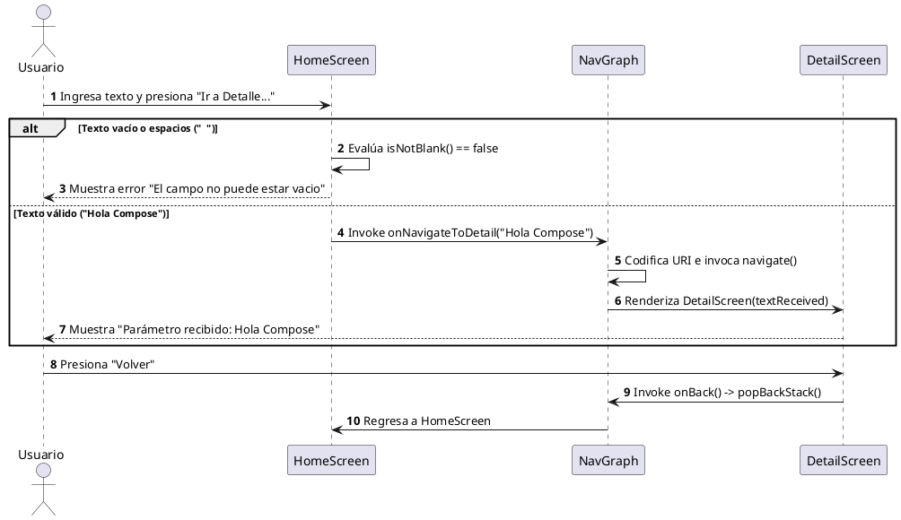

# Laboratorio 03: Estado, eventos y navegación entre pantallas con paso de parámetros

Este proyecto es una aplicación Android desarrollada en **Kotlin** y **Jetpack Compose** para el curso de Investigación y Desarrollo en Nuevas Tecnologías (IDNP) de la **Universidad Nacional de San Agustín (UNSA)**.

La aplicación demuestra el uso de navegación declarativa entre pantallas, gestión de estados editables, validación de entradas de usuario, paso de parámetros codificados y navegación hacia atrás utilizando la pila de actividades (`back stack`).

---

## 🚀 Características y Funcionalidades

1. **Arquitectura basada en Composables Separados:**
   - `HomeScreen`: Pantalla de inicio con un formulario de entrada.
   - `DetailScreen`: Pantalla secundaria que recibe y despliega el texto enviado.
2. **Gestión de Estado y Validación:**
   - Campo de texto editable (`OutlinedTextField`) conectado a un estado mutable.
   - Validación con `.isNotBlank()` que previene la navegación con texto vacío o compuesto únicamente de espacios.
   - Manejo de estado de error visual con mensajes explicativos.
3. **Navegación con Jetpack Navigation Compose:**
   - Uso de `NavHost` y `NavController` para coordinar las transiciones.
   - Definición de rutas fuertemente tipadas mediante una clase sellada `Screen`.
   - Codificación segura de parámetros con `Uri.encode()` para prevenir errores con caracteres especiales y espacios en las URIs.
   - Acción de retorno (`popBackStack()`) para volver a la pantalla anterior.

---

## 🛠️ Tecnologías Utilizadas

- **Lenguaje:** Kotlin
- **UI Toolkit:** Jetpack Compose
- **Diseño:** Material Design 3 (Material3)
- **Navegación:** `androidx.navigation:navigation-compose`
- **Mapeo de Rutas:** Sealed Class Pattern

---

## 📂 Estructura del Proyecto

```text
com.unsa.lab03idnp/
├── MainActivity.kt                # Punto de entrada de la aplicación
└── ui/
    ├── navigation/
    │   ├── NavGraph.kt            # Configuración de NavHost y rutas de la app
    │   └── Screen.kt              # Sealed class con la definición de rutas y helpers
    ├── screens/
    │   ├── home/
    │   │   └── HomeScreen.kt      # Pantalla principal con campo de texto y validación
    │   └── detail/
    │       └── DetailScreen.kt    # Pantalla de detalle que muestra el parámetro recibido
    └── theme/
        ├── Color.kt               # Paleta de colores Material 3
        ├── Theme.kt               # Configuración del tema global
        └── Type.kt                # Tipografía de la app
```

---

## 🔄 Flujo de Navegación y Arquitectura

### Diagrama de Secuencia



---

## 🧪 Casos de Prueba Evaluados

| # | Caso de Prueba | Entrada | Comportamiento Esperado | Estado |
|---|---|---|---|---|
| 1 | **Texto Normal** | `"Hola Compose"` | El texto se codifica correctamente y se navega a la pantalla de detalle mostrando el parámetro. |  |
| 2 | **Texto con Espacios** | `"   "` | `isNotBlank()` evalúa a `false`. No se realiza la navegación y se muestra el mensaje de error visual. *(Si el texto es `"Hola Mundo"`, navega codificando el espacio).* |  |
| 3 | **Campo Vacío** | `""` | `isNotBlank()` evalúa a `false`. Se activa el estado de error en el `OutlinedTextField`. |  |

---

## ⚙️ Requisitos de Ejecución

- **Android Studio:** Jellyfish / Koala o superior.
- **JDK:** 17 o superior.
- **Min SDK:** 24 (Android 7.0)
- **Target SDK:** 34 (Android 14)

---
